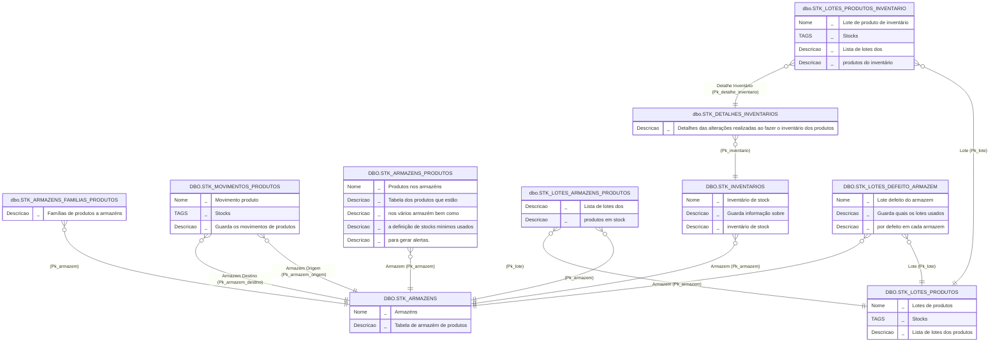
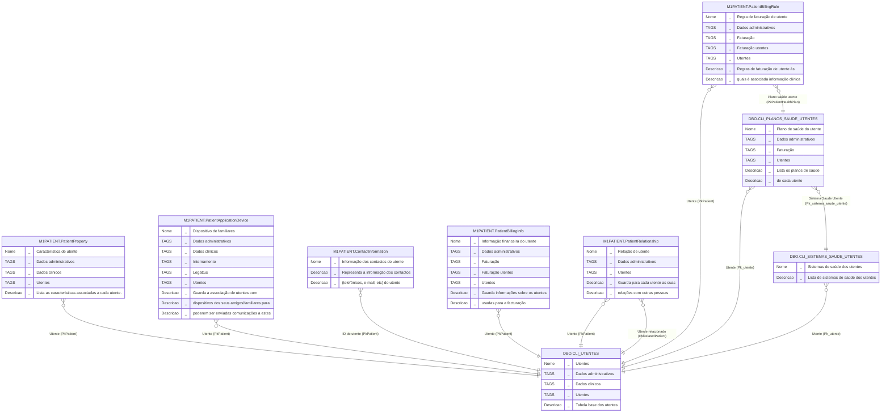
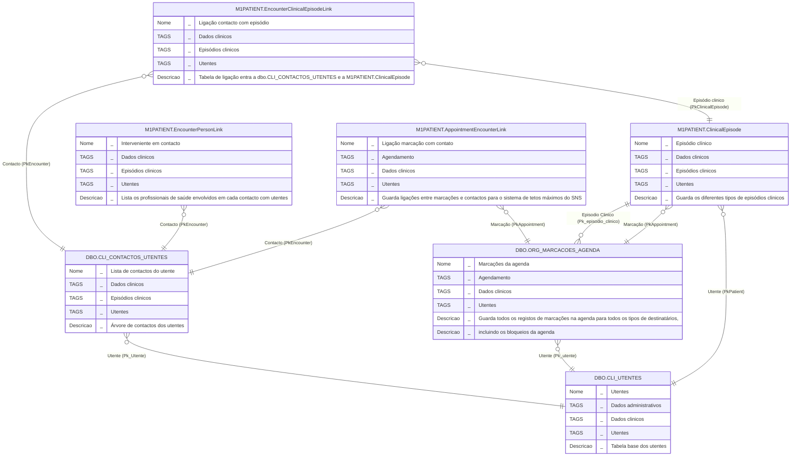

# Manual de introdução à BD MedicineOne

A BD MedicineOne tem atualmente de base mais de duas mil tabelas, que guardam todas as informações que o software M1 gera, desde dados clinicos de utentes, dados de configuração das organizações, dados de faturação, dados de integrações e muitas outras categorias. De forma a tentar facilitar a pesquisa pelas tabelas, estas estão organizadas por SCHEMA ou por prefixo no caso das tabelas no SCHEMA DBO.

Inicialmente as tabelas tinham nomenclatura em português e estavam todas incluídas no schema dbo base sendo assumida a sua organização ou agrupamento da lógica dos dados guardados em cada tabela pelos prefixos dados às mesmas (por exemplo: CLI, ORG, FACT, etc.) Mais tarde, com o crescimento da BD, do aumento da complexidade e no sentido de se seguir uma nomenclatura mais organizada e tentando ser mais intuitiva, assumiu-se que os nomes de novas tabelas associadas ao modelo de dados como foi concebido inicialmente, passasse a ser em inglês e em vez de agrupar tudo no shema dbo e utilizando prefixos para as tabelas, passou-se a utilizar schemas diferentes para guardar os dados que fossem comuns tendo em conta a lógica inerente aos mesmos.

Para facilitar a consulta de tabelas foram criadas TAGs e associadas a cada tabela, neste site podemos filtrar a nossa pesquisa por conjunto de TAGs e assim obter as tabelas de cada âmbito. Na documentação abaixo são indicadas as TAGs que devem ser usadas para obter a listagem de tabelas de cada âmbito.

## Schemas

- **dbo** - Schema original da BD com tabelas com nome em português, fora algumas exceções não serão criadas novas tabelas neste schema
- **HEALTHPORTAL** - DESCONTINUADO
- **INTBR** - DESCONTINUADO
- **INTCV** - DESCONTINUADO
- **M1AUDITING** - Sistema de auditoria da BD. Guarda as alterações feitas em tabelas designadas para o efeito. O número de tabelas neste schema depende das tabelas em que o sistema de logging esteja ativo
- **M1BILLING** - Dados de faturação
- **M1BIOMETRICSENSORS**
- **M1CALLCENTERLIST** - Tabelas de lookup para o centro de chamadas
- **M1INTEGRATION** - Tabelas para integração com softwares externos
- **M1LICENSING** - Tabelas do licenciamento do M1
- **M1LIST** - Tabelas de listagens que servem para alimentar lookups, normalmente os registos não estão associados a organizações especificas
- **M1LOCALIZATION** - Contêm tabelas de tradução de outras tabelas
- **M1LOGGING** - Dados de logging de eventos da BD
- **M1ORGANIZATION** - Dados de configuração das organizações
- **M1PATIENT** - Dados clínicos de utentes
- **M1PAYMENT**
- **M1SECURITY** - Dados de segurança e autenticação
- **M1SYSTEM** - Dados para configuração do sistema MedicineOne
- **M1SYSTEMSCHEDULER**
- **M1TELECONSULTATION** - Tabelas para suportar a teleconsulta
- **M1TEMPORARY** - Dados temporários
- **M1WALL** - Dados de suporte à aplicação WALL
- **PTLSORGANIZATION** - Dados de organização para o algoritmo de urgência PTLS
- **PTLSPATIENT** - Dados clinicos para o algoritmo de urgência PTLS
- **PTM1SYSTEM** - Dados de sistema exclusivos ao mercado PT
- **PTM1TEMPORARY** - Dados temporários para funcionalidades exclusivas PT
- **SAFT**
- **TISS** - DESCONTINUADO
- **TISSPACIENTE** - DESCONTINUADO

## Prefixos da DBO

- **AD** - DESCONTINUADO
- **ALIM** - Dados do módulo de alimentação
- **ARQ** - DESCONTINUADO
- **CLI** - Dados clinicos dos utentes, mas há várias tabelas que quebram esta regra ex. CLI_ACTOS_CLINICOS (equivale à M1PATIENT)
- **COM** - Dados de comunicação
- **CT** - Dados universais que não mudam entre instalações M1
- **ESTAT** - Dados do antigo módulo estatístico
- **FACT** - Dados de faturação (equivale à M1BILLING)
- **FERT** - Dados do módulo de fertilidade
- **FISIO** - Dados do módulo de fisioterapia
- **GESTOR** - Dados de sistema
- **LIGHT** - DESCONTINUADO
- **LOG** - Dados de logging de eventos da BD (equivale à M1LOGGING)
- **MT** - Dados do módulo de medicina do trabalho
- **NEONAT** - Dados do módulo de neonatologia
- **ORG** - Dados configuração da organização (equivale à M1ORGANIZATION)
- **STD** - Tabelas de listagens (equivale à M1LIST)
- **STK** - Módulo de Stocks
- **SYS** - Dados para configuração do sistema (equivale à M1SYSTEM)
- **TMP** - Dados temporários (equivale a M1TEMPORARY)
- **USFM** - DESCONTINUADO
- **WEB** - DESCONTINUADO

## Campos chave (primary keys) e chaves estrangeiras (foreign keys)

Nas tabelas mais antigas (schema DBO)

- Os campos correspondentes às chaves primárias das tabelas são, normalmente, chamadas Pk, e serão, na maioria, do tipo uniqueidentifier/GUID
- Os campos das chaves estrangeiras, na sua designação, são começados, normalmente, por Pk e depois o nome da tabela original (sem o prefixo) à qual fazem referência, sendo as palavras componentes do nome completo separadas pelo caracter subtraço ou underscore (snake_casing) (por exemplo: *Pk_acto_clinico* utilizado em várias tabelas da forma inicial e que referencia o campo Pk da tabela CLI_ACTOS_CLINICOS).

Nas tabelas mais recentes (schemas em inglês)

- Os campos chave são designados na mesma por Pk, mas são do tipo int ou bigint;
- Os campos das chaves estrangeiras, na sua designação, são começados, normalmente, por Pk e depois o nome da tabela original à qual fazem referência, sendo as palavras componentes do nome completo começados por letra maiúscula (Pascal casing) (por exemplo: *PkClinicalEpisodeType* da tabela M1PATIENT.ClinicalEpisode que referência o campo Pk da tabela M1LIST.ClinicalEpisodeType).

Campos chave identity

- Nas tabelas criadas segundo a forma inicial (tabelas em português), foram criados ou adicionados novos campos chave do tipo int ou bigint e que na maioria das vezes são utilizados para ligar às tabelas que seguem a forma atual da estrutura da BD;
- Esses novos campos foram designados na sua grande maioria de *M1SysClKey* e permitem melhor gestão e desempenho por usarem um tipo de dados que ocupa menos espaço que os GUIDs e é sequencial gerando assim menos fragmentação.

# Entidades principais

Na BD existem algumas entidades/tabelas sobre as quais grande parte das outras tabelas giram à volta, grande parte das pesquisas na BD vão focar-se numa ou mais das seguintes entidades.

## Organizações

*TAGs: Configuração -> Configuração por organização;*

A tabela dbo.ORG_ORGANIZACOES guarda os vários tipos de organizações criadas no M1, desde as organizações do proprietário do SI, até organizações onde trabalham os utentes, organizações prestadoras de cuidados de saúde convencionadas a outras. Todos os dados de configuração duma organização tem ligação a esta tabela quer diretamente quer através de uma das seguintes entidades:

### Pessoas/Utilizadores

*TAGs: Configuração -> Configuração por organização;*

Qualquer pessoa de uma organização registada no SI que faça uso direto do M1 tem que ter uma ficha criada na tabela dbo.ORG_PESSOAS, caso precise de fazer login no M1 precisa também de ter um registo na dbo.ORG_UTILIZADORES. A maior parte dos dados clinicos tem ligação à coluna dbo.ORG_UTILIZADORES.Sql_username ou à coluna ORG_UTILIZADORES.Pk para identificar o autor de registos clínicos. A relação entre estas tabelas é de 1 para 1, no entanto a mesma pessoa pode ter várias contas, uma por organização onde trabalhe, estas contas podem ser interligadas entre si pelo campo *Pk_conta_principal* da DBO.ORG_UTILIZADORES.

Exemplo:  

```sql
SELECT * from dbo.ORG_UTILIZADORES ou inner join dbo.ORG_PESSOAS pes on pes.Pk = ou.Pk_pessoa
```
[test anchor](#entidades-principais)
### Estrutura orgânica

*TAGs: Configuração -> Configuração por organização;*

A tabela dbo.ORG_ESTRUTURA_ORGANICA guarda informação sobre a estrutura orgânica de cada organização no SI.

*TAGs: Configuração -> Configuração por organização; Internamento;*

Associada a esta tabela temos também as tabelas que guardam a estrutura do internamento começando com a tabela dbo.CLI_AREAS_INTERNAMENTO.

### Locais

*TAGs: Configuração -> Configuração por organização;*

A tabela dbo.ORG_LOCAIS_ORGANIZACAO lista os locais físicos de cada organização.

## Atos clinicos

### Dados

*TAGs: Configuração;*

A tabela dbo.CLI_ACTOS_CLINICOS guarda a lista de procedimentos que podem ser realizados dentro do M1 em qualquer tipo de episódio clínico, ou registos extra que não sejam clínicos mas que sejam para faturar.

A tabela M1PATIENT.AppointmentClinicalProcedure one se podem ligar os Atos a Marcações, Utentes e Atos para Faturação

*TAGs: Dados clinicos;*

A tabela principal que guarda os atos associados a cada utente é a dbo.CLI_ACTOS_CLINICOS_UTENTES.

*TAGs: Configuração -> Configuração por organização Faturação;*

A tabela dbo.FACT_PRECOS_ACTOS_CLINICOS_POR_PLANO_SAUDE guarda as regras de faturação de cada produto para cada plano de saúde.

<details open>
  <summary>Ver diagrama (Configuração)</summary>
<!--
DBO.CLI_ACTOS_CLINICOS
DBO.CLI_ACTOS_CLINICOS_UTENTES
DBO.STD_CLASSIFICACOES_ACTOS_CLINICOS
DBO.CLI_DECOMPOSICAO_ACTOS_CLINICOS
DBO.CLI_DEFINICOES_GRUPOS_RESULTADOS_ACTOS_CLINICOS
DBO.CLI_DEFINICOES_RESULTADOS_ACTOS_CLINICOS
DBO.STD_ACTOS_CLINICOS_CLASSIFICACOES
DBO.CLI_ACTOS_CLINICOS_PARA_FACTURACAO
DBO.FACT_PRECOS_ACTOS_CLINICOS_POR_PLANO_SAUDE
M1LIST.ClinicalProcedureType
-->


</details>

### Faturaçao

*TAGs: Configuração; Configuração por organização; Faturação;*

A faturação relativa a atos clinicos, encontra-se guardada na tabela DBO.CLI_ACTOS_CLINICOS_PARA_FACTURACAO, que também faz a ligação com as respetivas faturas e detahes da fatura usando as tabelas DBO.FACT_DETALHE_FACTURAS e DBO.FACT_FACTURAS.
Na tabela DBO.FACT_PRECOS_ACTOS_CLINICOS_POR_PLANO_SAUDE estão definidos os preços dos produtos por plano de saúde.

<details open>
  <summary>Ver diagrama</summary>
<!--
DBO.CLI_ACTOS_CLINICOS_PARA_FACTURACAOO
DBO.FACT_DETALHE_FACTURAS
DBO.FACT_FACTURAS
DBO.FACT_PRECOS_ACTOS_CLINICOS_POR_PLANO_SAUDE
-->


</details>

## Produtos/Artigos

### Dados

*TAGs: Configuração; Stocks;*

A tabela base dos Produtos / Artigos é a dbo.STK_PRODUTOS sendo complementada pela tabela de extensão M1ORGANIZATION.DrugProduct quando se trata de um medicamento.
Estes produtos podem ser agregados em pacotes definidos em dbo.STK_SUBPRODUTOS_DO_PRODUTO.
Definições sobre unidade de produto, classificações, categorias, tipos de movimentos de stocks e disponibilidades são guardadas nas tabelas:

- dbo.STD_UNIDADES_PRODUTOS
- dbo.STK_CATEGORIAS_PRODUTOS
- dbo.STK_FAMILIAS_PRODUTOS

As tabelas dbo.STK_FORNECEDORES_PRODUTOS e dbo.STK_FORNECEDORES_PRODUTOS_PRECOS guardam ainda informação sobre os fornecedores de cada produto bem como dos preços de aquisição desses mesmos produtos em determinada data.

Quando os produtos são medicamentos, devem ainda observar-se informação sobre vias de administração (Esta contem tambem o código CHNM) e respetivas frequências, códigos, dosagens, validação de consumos e link para prescrições de enfermagem:

- M1ORGANIZATION.DrugProduct
- M1LIST.DrugProductDosageCalculationMethod
- M1ORGANIZATION.DrugProductAdministrationRoute
- M1ORGANIZATION.DrugProductAdministrationRouteFrequency
- M1ORGANIZATION.DrugProductATCCode
- M1ORGANIZATION.DrugProductDosage
- M1ORGANIZATION.DrugProductNursingPrescriptionTypeLink
- M1PATIENT.DrugProductValidation

<details open>
  <summary>Ver diagrama</summary>
<!--
dbo.STK_PRODUTOS
dbo.STK_SUBPRODUTOS_DO_PRODUTO
dbo.STD_IVA
dbo.STD_UNIDADES_PRODUTOS
dbo.STK_CATEGORIAS_PRODUTOS
dbo.STK_FAMILIAS_PRODUTOS
dbo.STK_FORNECEDORES_PRODUTOS
dbo.STK_FORNECEDORES_PRODUTOS_PRECOS
M1LIST.DrugProductDosageCalculationMethod
M1ORGANIZATION.DrugProduct
M1ORGANIZATION.DrugProductAdministrationRoute
M1ORGANIZATION.DrugProductAdministrationRouteFrequency
M1ORGANIZATION.DrugProductATCCode
M1ORGANIZATION.DrugProductDosage
M1ORGANIZATION.DrugProductNursingPrescriptionTypeLink
M1PATIENT.DrugProductValidation
-->


</details>

### Stocks

*TAGs: Stocks;*

A gestão de stocks de produtos é feita por armazém, sendo a tabela DBO.STK_ARMAZENS_PRODUTOS que guarda a relação entre produtos e quantidades e respetivos armazens, tendo estes que estarem previamente definidos em DBO.STK_ARMAZENS.
Se a gestão se stocks é feita por lotes de produtos, é na tabela DBO.STK_LOTES_PRODUTOS que se definem a que lotes estão os produtos associados. A tabela STK_LOTES_ARMAZENS_PRODUTOS faz a ligação entre lotes, armazéns e produtos.

<details open>
  <summary>Ver diagrama</summary>
<!--
DBO.STK_INVENTARIOS
DBO.STK_ARMAZENS
DBO.STK_ARMAZENS_FAMILIAS_PRODUTOS
DBO.STK_ARMAZENS_PRODUTOS
DBO.STK_LOTES_ARMAZENS_PRODUTOS
DBO.STK_MOVIMENTOS_PRODUTOS
DBO.STK_EXCEPCOES_TIPOS_MOVIMENTOS_STOCKS
DBO.STK_TIPOS_MOVIMENTOS_STOCKS
DBO.STK_LOTES_PRODUTOS
DBO.STK_LOTES_ARMAZENS_PRODUTOS
DBO.STK_LOTES_DEFEITO_ARMAZEM
DBO.STK_DETALHES_INVENTARIOS
DBO.STK_LOTES_PRODUTOS_INVENTARIO
-->



</details>

[header](#entidades-principais)

### Faturaçao

*TAGs: Configuração; Configuração por organização; Faturação;*

A faturação relativa a Produtos, encontra-se guardada na tabela DBO.CLI_CONSUMOS_PARA_FACTURACAO, que também faz a ligação com as respetivas faturas e detahes da fatura usando as tabelas DBO.FACT_DETALHE_FACTURAS e DBO.FACT_FACTURAS
Nas tabelas DBO.CLI_CONSUMOS_ACTOS_CLINICOS e DBO.CLI_CONSUMOS_INTERVENCOES_ENFERMAGEM são guardados as quantidades dos consumos relativos a atos clinicos e outras intervenções.
Na tabela DBO.FACT_PRECOS_CONSUMOS_POR_PLANO_SAUDE estão definidos os preços dos produtos por plano de saúde.

<details open>
  <summary>Ver diagrama</summary>
<!--
DBO.CLI_CONSUMOS_ACTOS_CLINICOS
DBO.CLI_CONSUMOS_INTERVENCOES_ENFERMAGEM
DBO.CLI_CONSUMOS_PARA_FACTURACAO
DBO.FACT_DETALHE_FACTURAS
DBO.FACT_FACTURAS
DBO.FACT_PRECOS_CONSUMOS_POR_PLANO_SAUDE
-->


</details>

## Utentes

*TAGs: Dados administrativos; Utentes;*

A tabela dbo.CLI_UTENTES guarda a lista de utentes com ficha criada no M1 e guarda sobretudo dados administrativos de cada utente, todos os dados clínicos apontam para esta tabela, para a coluna M1SysClKey ou Pk conforme o tipo de dados da chave estrangeira.
Outros dados do utente são guardados em tabelas relacionadas como:

- M1PATIENT.ContactInformation - Informação relativa a telefones e emails
- DBO.CLI_PLANOS_SAUDE_UTENTES - Planos de saúde do utente
- DBO.CLI_SISTEMAS_SAUDE_UTENTES - EFRs do utente, os planos do utente também estão ligados a esta tabela
- M1PATIENT.PatientApplicationDevice - Guarda a associação de utentes com dispositivos dos seus amigos/familiares para poderem ser enviadas comunicações
- M1PATIENT.PatientBillingInfo - Guarda informações usadas para a facturação
- M1PATIENT.PatientBillingRule - Regras de faturação de utente às quais é associada informação clínica
- M1PATIENT.PatientProperty - Lista as caracteristicas associadas a cada utente
- M1PATIENT.PatientRelationship - Guarda para cada utente as suas relações com outras pessoas

<details open>
  <summary>Ver diagrama</summary>
<!--
DBO.CLI_UTENTES	Utentes
DBO.CLI_PLANOS_SAUDE_UTENTES
DBO.CLI_SISTEMAS_SAUDE_UTENTES
M1PATIENT.ContactInformation
M1PATIENT.PatientApplicationDevice
M1PATIENT.PatientBillingInfo
M1PATIENT	PatientBillingRule
M1PATIENT.PatientProperty
M1PATIENT.PatientRelationship
-->



</details>

## Episódios clinicos

*TAGs: Dados clinicos; Episódios clinicos;*

No M1 toda a informação clínica registada fica agrupada debaixo de um episódio clínico, a estrutura de dados funciona como uma hierarquia tendo no topo a M1PATIENT.ClinicalEpisode que guarda as informações comuns a todos os tipos de episódios clínicos. Alguns episódios podem estar associados entre si numa relação pai filho, por exemplo um episódio cirúrgico pode ter um internamento como pai representado pela coluna *PkParent*.
Um episódio pode ser criado via uma marcação, numa urgência ou por um contacto com o utente (Ex. o Medico marca uma sessão de fisioterapia e o episodio de Fisioterapia é criado). Um Episódio poderá ter vários contactos, mas o contrário não é possível. 

Dependendo do tipo de episódio outras tabelas também serão preenchidas, estas tabelas tem o mesmo valor de Pk da M1PATIENT.ClinicalEpisode:

- **Internamentos** - a tabela dbo.CLI_INTERNAMENTOS_UTENTES é a tabela central dos episódios de internamento
- **Cirurgias** - a tabela dbo.CLI_EPISODIOS_CIRURGICOS é a tabela central dos episódios cirurgicos, abaixo desta temos a dbo.CLI_CIRURGIAS_UTENTE que agrupa os dados de cada cirurgia dentro de um episódio
- **Ambulatório** - a tabela M1PATIENT.AmbulatoryEpisode guarda dados extra para episódios de ambulatório. A tabela dbo.ORG_MARCACOES_AGENDA guarda os dados de cada marcação
- **Urgência** - a tabela M1PATIENT.EmergencyRoomEpisode é a tabela central dos episódios de urgência
- **Sinistros/Medicina do trabalho** - a tabela dbo.MT_ACIDENTES_TRABALHO_UTENTES é a tabela central dos sinistros
- **Fisioterapia** - a tabela M1PATIENT.PhysicalTherapyEpisode guarda dados extra para episódios de fisioterapia.
- **Hospital de dia** - a tabela M1PATIENT.DayCareEpisode guarda dados extra para episódios de fisioterapia.

<details open>
  <summary>Ver diagrama</summary>


</details>

### Episódios Cirurgicos

*TAGs: Dados clinicos; Bloco operatório;*

A tabela DBO.CLI_EPISODIOS_CIRURGICOS, é a tabela central que guarda a informação dos episódios cirurgicos do utente. Liga diretamente com um conjunto de tabelas onde outro tipo de informação é guardada:

- DBO.CLI_CIRURGIAS_UTENTE - Tabela com informação especifica sobre as cirurgias dos utentes
- DBO.CLI_EQUIPA_CIRURGICA_DA_CIRURGIA - Guarda a informação relativa á equipa de que realizou a cirurgia e respetivas funções
- M1PATIENT.SurgeryEpisodeStateLog - Guarda a informação de todos os vários passos que ocorreram durante a cirurgia e respetivos estados
- M1PATIENT.SurgeryEventTime - Guarda a data/hora de todos os eventos da cirurgia

<details open>
  <summary>Ver diagrama</summary>
<!--
DBO.CLI_CIRURGIAS_UTENTE
DBO.CLI_EPISODIOS_CIRURGICOS
DBO.CLI_EQUIPA_CIRURGICA_DA_CIRURGIA
M1PATIENT.SurgeryEpisodeStateLog
M1PATIENT.SurgeryEventTime
-->


</details>

### Episódios Ambulatório

*TAGs: Consulta Ambulatório; Episódio Clinicos;*

A tabela M1PATIENT.AmbulatoryEpisode é a tabela auxiliar que guarda informação dos episódios de ambulatório. Está ligada à DBO.CLI_CONTACTOS_UTENTES pela M1PATIENT.EncounterClinicalEpisodeLink e esta liga depois à DBO.CLI_INTERVINIENTES_CONTACTOS_UTENTES, que é onde está guardada a informação dos SOAPs/textos registados na consulta.

Outras tabelas com informação relevante são:

- M1ORGANIZATION.ClinicalFileRules - Guarda regras para o funcionamento do processo clinico dos utentes. Estas regras ficam ao nivel de cada organização
- M1ORGANIZATION.PersonAppointmentClinicalProcedure - Indica qual o ato a registar numa consulta por combinação de pessoa com tipo de contacto e Ato clinico
- M1PATIENT.SOAPNoteExtension - Esta tabela guarda campos de extensão da tabela DBO.CLI_INTERVINIENTES_CONTACTOS_UTENTES, a relação é feita para a coluna M1SysClKey
- M1PATIENT.SoapNoteProgressNote - Guarda informação adicional/evolução associada a SOAPs iniciais. Esta informação pode ser de autores diferentes do SOAP original. Este tipo de registo é usado apenas quando o tipo de notas médicas é o SOAP

<details open>
  <summary>Ver diagrama</summary>
<!--
M1PATIENT.AmbulatoryEpisode
M1PATIENT.ClinicalEpisode
M1PATIENT.EncounterClinicalEpisodeLink
DBO.CLI_CONTACTOS_UTENTES
DBO.CLI_INTERVINIENTES_CONTACTOS_UTENTES
M1ORGANIZATION.ClinicalFileRules
M1ORGANIZATION.PersonAppointmentClinicalProcedure
M1PATIENT.SOAPNoteExtension
M1PATIENT.SoapNoteProgressNote
M1PATIENT.Teleconsultation
M1PATIENT.CustomFormSOAPNoteLink
-->


</details>

## Contactos clínicos

*TAGs: Dados clinicos; Episódios clinicos;*

A tabela dbo.CLI_CONTACTOS_UTENTES guarda a lista de contatos que cada utente teve com uma organização no âmbito de cada episódio clínico, a ligação com os episódios clínicos M1PATIENT.ClinicalEpisode é feito pela tabela M1PATIENT.EncounterClinicalEpisodeLink.
Existem outras tabelas uteis de ligação: A tabela M1PATIENT.AppointmentEncounterLink faz a ligação com a DBO.ORG_MARCACOES_AGENDA de forma a ligar com marcações e a M1PATIENT.EncounterPersonLink faz a ligação com a DBO.ORG_PESSOAS de forma a obter todos os profissionais envolvidos em cada contato.

<details open>
  <summary>Ver diagrama</summary>
<!--
M1PATIENT.EncounterPersonLink
M1PATIENT.ClinicalEpisode
M1PATIENT.EncounterClinicalEpisodeLink
M1PATIENT.AppointmentEncounterLink
DBO.CLI_CONTACTOS_UTENTES
DBO.ORG_MARCACOES_AGENDA
DBO.CLI_UTENTES
-->



</details>

## Marcações da agenda

*TAGs: Agendamento; Dados clinicos;*

A tabela dbo.ORG_MARCACOES_AGENDA é a tabela central das marcações para todos os tipos de agendas (pessoas, locais e equipamentos).

A coluna Pk_agenda é a combinação (COALESCE) das colunas Pk_pessoa, Pk_local e Pk_equipamento, visto que só uma destas poderá estar preenchida por registo. Esta coluna deverá ser usada para efectuar qualquer tipo de pesquisa sobre as marcações em vez das outras 3 colunas.

A partir desta tabela pode-se obter os atos clinicos através da tabela M1PATIENT.AppointmentClinicalProcedure, também tem ligação direta ao episódio clinico na coluna *Pk_episodio_clinico*.

<details open>
  <summary>Ver diagrama</summary>
<!--
M1PATIENT.AppointmentClinicalProcedure
M1PATIENT.ClinicalEpisode
M1PATIENT.Teleconsultation
M1LOGGING.AppointmentAdmissionTracking
DBO.ORG_EQUIPAMENTOS
DBO.ORG_MOVIMENTOS_UTENTES
DBO.ORG_SALAS_ESPERA
DBO.ORG_LOCAIS_ORGANIZACAO
DBO.ORG_MARCACOES_AGENDA
DBO.ORG_PESSOAS
DBO.CLI_UTENTES
DBO.ORG_CARACTERISTICAS_MARCACOES_AGENDA
DBO.STD_ESTADOS_PRESENCA_UTENTES
DBO.STD_TIPOS_SLOTS_MARCACOES
-->



</details>

```mermaid
erDiagram
t1["M1PATIENT.AppointmentClinicalProcedure"]{Nome _ "Ato clinico agendado" TAGS _ "Agendamento" TAGS _ "Dados clinicos" TAGS _ "Utentes" Descricao _ "Lista de atos clinicos associados a" Descricao _ "uma marcação de agenda" }
t10["DBO.ORG_PESSOAS"]{Nome _ "Pessoas" TAGS _ "Configuração" TAGS _ "Configuração por organização" TAGS _ "Dados administrativos" TAGS _ "Entidade principal" TAGS _ "Honorários" Descricao _ "Tabela de pessoas. Contém toda a informação" Descricao _ "sobre uma pessoa, dados administrativos, moradas," Descricao _ "profissionais, financeiros, acordos etc..." }
t11["M1PATIENT.Teleconsultation"]{Nome _ "Teleconsulta" TAGS _ "Dados clinicos" TAGS _ "Teleconsulta" TAGS _ "Utentes" Descricao _ "Tabela de extensão da M1TELECONSULTATION.Teleconsultation" Descricao _ "para dados clinicos" }
t12["DBO.STD_TIPOS_SLOTS_MARCACOES"]{Nome _ "Tipos slots de marcações" TAGS _ "Agendamento" TAGS _ "Configuração" TAGS _ "Configuração por organização" TAGS _ "Horários" Descricao _ "Tipos de slots de marcações." Descricao _ "Permite associar uma cor e uma especialidade." Descricao _ "Permite também indicar se o slot" Descricao _ "pode ser facturável ou não." }
t13["DBO.CLI_UTENTES"]{Nome _ "Utentes" TAGS _ "Dados administrativos" TAGS _ "Dados clinicos" TAGS _ "Utentes" Descricao _ "Tabela base dos utentes" }
t14["DBO.ORG_SALAS_ESPERA"]{Nome _ "Utentes na sala de espera" TAGS _ "Consulta ambulatório" TAGS _ "Dados administrativos" TAGS _ "Dados clinicos" TAGS _ "Urgência" TAGS _ "Utentes" Descricao _ "Guarda os utentes que se encontram" Descricao _ "atualmente nalgum tipo de sala de espera." }
t2["dbo.ORG_CARACTERISTICAS_MARCACOES_AGENDA"]{Nome _ "Caracteristica da marcação" TAGS _ "Agendamento" TAGS _ "Dados clinicos" TAGS _ "Utentes" Descricao _ "Caracteristicas personalizadas de cada" Descricao _ "marcação da agenda" }
t3["M1PATIENT.ClinicalEpisode"]{Nome _ "Episódio clínico" TAGS _ "Dados clinicos" TAGS _ "Episódios clinicos" TAGS _ "Utentes" Descricao _ "Guarda os diferentes tipos" Descricao _ "de episódios clinicos" }
t4["DBO.ORG_EQUIPAMENTOS"]{Nome _ "Equipamentos de imagiologia" TAGS _ "Configuração" TAGS _ "Configuração por organização" Descricao _ "Lista de equipamentos de" Descricao _ "imagiologia da organização" }
t5["DBO.STD_ESTADOS_PRESENCA_UTENTES"]{Nome _ "Estados de presença" Descricao _ "Estados de presença dos utentes." Descricao _ "Usado por exemplo nas marcações da agenda" Descricao _ "com estados tais como: Ainda não chegou," Descricao _ "Chegou, Aguarda atendimento, Em atendimento, etc..." }
t6["DBO.ORG_MOVIMENTOS_UTENTES"]{Nome _ "Histórico da marcação" TAGS _ "Agendamento" TAGS _ "Dados clinicos" TAGS _ "Utentes" Descricao _ "Guarda todos os movimentos e alterações" Descricao _ "que acontecem com as marcações da agenda" }
t7["DBO.ORG_LOCAIS_ORGANIZACAO"]{Nome _ "Locais das organizações" TAGS _ "Configuração" TAGS _ "Configuração por organização" Descricao _ " Contém toda a informação sobre" Descricao _ "os locais da organização, a sua estrutura," Descricao _ "agendas, contactos, indicação" Descricao _ "sobre acordos de convencionados e informações" Descricao _ "do portal de agendamento." }
t8["M1LOGGING.AppointmentAdmissionTracking"]{Nome _ "Log de admissão" TAGS _ "Agendamento" TAGS _ "Auditoria" Descricao _ "Guarda informação sobre os" Descricao _ "tempos de admissão de utentes" }
t9["DBO.ORG_MARCACOES_AGENDA"]{Nome _ "Marcações da agenda" TAGS _ "Agendamento" TAGS _ "Dados clinicos" TAGS _ "Utentes" Descricao _ "Guarda todos os registos de marcações" Descricao _ "na agenda para todos os tipos de destinatários," Descricao _ "incluindo os bloqueios da agenda" }
t13 }o--|| t7 : "Local Habitual Consultas (Pk_local_habitual_consultas)"
t13 }o--|| t7 : "Local Realização Exames Medicina do Trabalho (Pk_local_realizacao_exames_MT)"
t9 }o--|| t7 : "Local (Pk_local)"
t9 }o--|| t7 : "Local Realização (Pk_local_realizacao)"
t9 }o--|| t7 : "Local Atual (Pk_local_actual)"
t14 }o--|| t7 : "Local (Pk_local)"
t14 }o--|| t7 : "Local Pessoa Chamou (Local_pessoa_chamou)"
t6 }o--|| t7 : "Local (Pk_Local)"
t6 }o--|| t7 : "Local Marcação (Pk_local_marcacao)"
t4 }o--|| t7 : "Local (Pk_Local)"
t10 }o--|| t10 : "Médico Orientador (Pk_medico_orientador)"
t14 }o--|| t10 : "Pessoa Chamou (Pessoa_chamou)"
t9 }o--|| t10 : "Pessoa (Pk_pessoa)"
t6 }o--|| t10 : "Pessoa Marcação (Pk_pessoa_marcacao)"
t9 }o--|| t10 : "Pessoa prestador (Pk_pessoa_prestador)"
t8 }o--|| t10 : "Pessoa (PkPerson)"
t9 }o--|| t3 : "Episodio Clinico (Pk_episodio_clinico)"
t14 }o--|| t13 : "Utente (Pk_utente)"
t9 }o--|| t13 : "Utente (Pk_utente)"
t6 }o--|| t13 : "Utente (Pk_utente)"
t3 }o--|| t13 : "Utente (PkPatient)"
t2 }o--|| t9 : "Marcação (Pk_marcacao)"
t3 }o--|| t9 : "Marcação (PkAppointment)"
t1 }o--|| t9 : "Marcação (PkAppointment)"
t6 }o--|| t9 : "Marcação Agenda (Pk_marcacao_agenda)"
t14 }o--|| t9 : "Marcação (Pk_marcacao)"
t8 }o--|| t9 : "Marcação (PkAppointment)"
t11 }o--|| t9 : "Marcação (PkAppointment)"
t9 }o--|| t12 : "Tipo Slot (Pk_tipo_slot)"
t9 }o--|| t5 : "Estado Presenca Utente (Pk_estado_presenca_utente)"
t6 }o--|| t4 : "Equipamento Marcação (Pk_equipamento_marcacao)"
t9 }o--|| t4 : "Equipamento (Pk_equipamento)"
t14 }o--|| t4 : "Equipamento (Pk_equipamento)"
```

## Horários

*TAGs: Agendamento -> Horários;*

A configuração dos horários centra-se nas seguintes tabelas dbo.ORG_HORARIOS_TRABALHO e na dbo.ORG_DEFINICOES_HORARIOS_TRABALHO.
Nestas tabelas guardam-se as definições dos horários de trabalho dos vários tipos de agenda (pessoas, locais e equipamentos). 
Na tabela dbo.ORG_DEFINICOES_HORARIOS_TRABALHO são escolhidos as horas e os tipos de slots para serem mostrados na agenda. O utilizador pode também definir cores, pausas e muitas outras opções como quotas, atos admissiveis, intervalos para o horário.
Na tabela dbo.ORG_HORARIOS_TRABALHO define-se Horários de trabalhos pertencentes a cada agenda, ou seja a Pessoa, local ou equipamento.


<details open>
  <summary>Ver diagrama</summary>
<!--
DBO.ORG_HORARIOS_TRABALHO
DBO.ORG_DEFINICOES_HORARIOS_TRABALHO
M1ORGANIZATION.ScheduleInterval
M1ORGANIZATION.ScheduleIntervalConfiguration
M1ORGANIZATION.ScheduleEntityQuota
DBO.ORG_PARTILHA_TEMPO_AGENDAS_ORGANIZACOES
STD_TIPOS_SLOTS_MARCACOES
M1ORGANIZATION.ScheduleEntityQuotaDetail
M1ORGANIZATION.ScheduleTimeslotDefinitionAccreditedPerson
M1ORGANIZATION.ScheduleTimeslotDefinitionClinicalProcedureQuota
M1ORGANIZATION.ScheduleClinicalProcedureQuota
M1ORGANIZATION.ScheduleTimeslotDefinitionEntityQuota
-->


</details>

[test anchor2](#entidades-principais)
## Formulários

*TAGs: Configuração -> Configuração por organização; Formulários;*

A configuração dos formulários centra-se na tabela dbo.STD_FORMULARIOS_PERSONALIZADOS. Partindo desta tabela relaciona-se toda a informação perguntas, tipos e respostas, layout, visibilidade, obrigatoriedade de resposta etc.

*TAGs: Dados clinicos; Formulários;*

Os formulários preenchidos com dados clinicos/administrativos centram-se na tabela M1PATIENT.CustomForm. Esta tabela guarda os formulários preenchidos dos utentes. A partir desta tabela pode-se obter toda a informação sobre utente, Episódios Clinicos, contactos, tratamentos, etc.
As respetivas respostas aos formulários estão na tabela M1PATIENT.CustomFormResponseValue. Quando esta resposta corresponde a 1 item duma lista de valores, o valor do campo será uma chave uniqueidentifier que correspode ao nome descrito na tabela STD_DETALHE_TIPO_RESPOSTA_FOMULARIOS_ITENS_LISTA.
